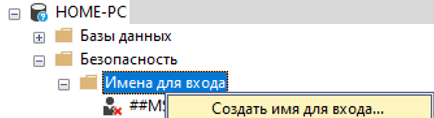
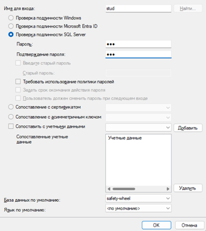
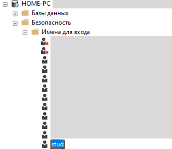

# SafetyWheel

## Описание
**SafetyWheel** — это приложение для автоматизации учебного процесса, связанного с тестированием участников конкурса «Безопасное колесо». Приложение разработано на **WPF** и для своей работы использует **.NET 8.0** и **MS SQL Server**.

Данный репозиторий содержит исходный код приложения, а также инструкции для разработчиков и пользователей по установке и использованию приложения.

---

## Требования

### Для разработчиков
- Любая среда разработки с поддержкой **WPF** (рекомендуется Visual Studio)
- **.NET SDK 8.0**
- **MS SQL Server** + инструмент для работы с БД (рекомендуется **SQL Server Management Studio, SSMS**)

### Для пользователей
- Windows x64
- Установленный **.NET 8.0 Runtime**
- Доступ к серверу MS SQL (локально или по сети)

---

## 📑 Содержание
- [Установка (для разработчиков)](#установка-для-разработчиков)
- [Установка (для пользователей)](#установка-для-пользователей)
- [Настройка базы данных](#настройка-базы-данных)
- [Настройка приложения (серверный ПК)](#настройка-приложения-серверный-пк)
- [Создание нового пользователя (преподавателя)](#создание-нового-пользователя-преподавателя)
- [Подключение ученических ПК к серверу](#подключение-ученических-пк-к-серверу)
- [Примечания](#примечания)

---

## Установка (для разработчиков)
1. Клонировать данный репозиторий.
2. Перейти к пункту Настройка базы данных.

---

## Установка (для пользователей)

**РЕКОМЕНДУЕТСЯ:**
1. Открыть терминал в **пустой папке** и написать 
```
git clone https://github.com/bbreadbread/SafetyWheel_App_Installation_Files
```

**ИЛИ:**
1. Перейдите по ссылке и скачайте архив:
   https://github.com/bbreadbread/SafetyWheel_App_Installation_Files
2. Распакуйте ZIP-архив в **пустую папку**.

### Состав установленных файлов
- **Teacher/** — приложение для регистрации преподавателей
  > ⚠️ Рекомендуется удалить эту папку на ученических ПК после установки
- **SafetyWheel/** — основное приложение и изображения для тестов
- **safety-wheel-struct.sql** — SQL‑скрипт создания структуры БД
- **safety-wheel-data.sql** — SQL‑скрипт заполнения БД тестовыми данными

---

## Настройка базы данных

1. Установите с официального сайта Microsoft **.NET 8.0**:
   https://dotnet.microsoft.com/ru-ru/download/dotnet/thank-you/sdk-8.0.417-windows-x64-installer
2. Установите **MS SQL Server** и **MSSMS**
3. Создайте новую базу данных с именем:
   ```
   safety-wheel
   ```
4. Выполните по очереди SQL‑скрипты:
   - `safety-wheel-struct.sql` — создание структуры БД
   - `safety-wheel-data.sql` — заполнение БД данными

После успешного выполнения БД готова к работе.

---

## Настройка приложения (серверный ПК)

1. Перейдите в папку **SafetyWheel**
2. Откройте файл `connection.settings`
3. Замените параметр сервера на наименование вашего сервера:
   ```
   (Server=НАЗВАНИЕ_СЕРВЕРА;...)
   ```
4. Сохраните файл
5. После успешного выполнения запустите файл `Safety-Wheel.exe`

---

## Создание нового пользователя (преподавателя)

1. Перейдите в папку **Teacher**
2. Откройте файл `connection.settings`
3. Укажите имя сервера:
   ```
   (Server=НАЗВАНИЕ_СЕРВЕРА;...)
   ```
4. Сохраните файл
5. Запустите `RegistrationTeacherSafetyWheel.exe`
6. Зарегистрируйте нового преподавателя

### Создание учеников
- Войдите в основное приложение под аккаунтом преподавателя
- Перейдите в меню **«Ученики преподавателя»**
- Создайте учеников — они будут автоматически привязаны к вашему аккаунту
  
---

## Подключение ученических ПК к серверу

### Подготовка базы данных

1. Создайте нового пользователя (Login) для БД в **MSSMS** и назначьте ему доступ к базе `safety-wheel`. Пример:
  <table align="center">
  <tr>
    <td align="center">
      <br>
      <sub>1. Создание имени</sub>
    </td>
    <td align="center">
      <br>
      <sub>2. Параметры</sub>
    </td>
    <td align="center">
      <br>
      <sub>3. Результат</sub>
    </td>
  </tr>
</table>

### Сетевая настройка

- Серверный и ученический ПК должны находиться в **одной локальной сети**
- На сервере необходимо:
  - Открыть входящий порт
  - Разрешить подключения к SQL Server

### Настройка клиента (ученический ПК)

1. Установите файлы приложения
2. Откройте файл `connection.settings`
3. Измените строку подключения:
   ```
   (Server=ИМЯ_СЕРВЕРА,ПОРТ;Database=safety-wheel;User Id=ИМЯ_ПОЛЬЗОВАТЕЛЯ;Password=ПАРОЛЬ;TrustServerCertificate=True)
   ```
4. Сохраните файл
5. Запустите `Safety-Wheel.exe`

Для удобства рекомендуется создать ярлык на рабочем столе:
**ПКМ → Отправить → Рабочий стол**

---

## Примечания
- Папку **Teacher** необходимо удалить с ученических ПК во избежание возможности создания учениками новых аккаунтов преподавателей.
- Все изменения в `connection.settings` выполняются вручную
- При ошибках подключения проверьте:
  - Имя сервера и порт
  - Логин и пароль
  - Настройки брандмауэра
  - Состояние сети

